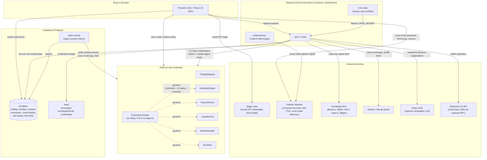
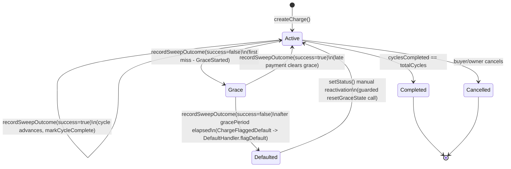
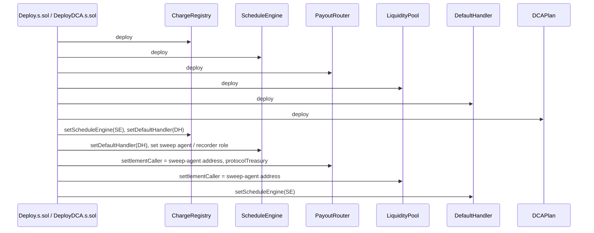
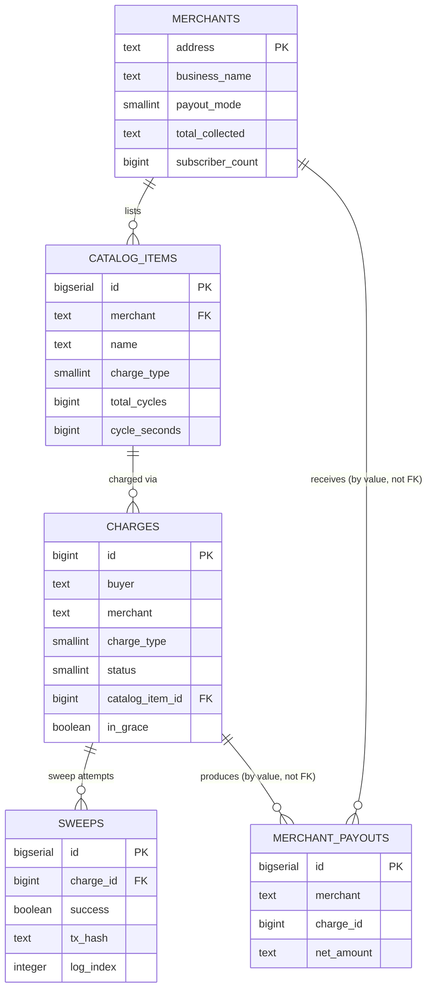
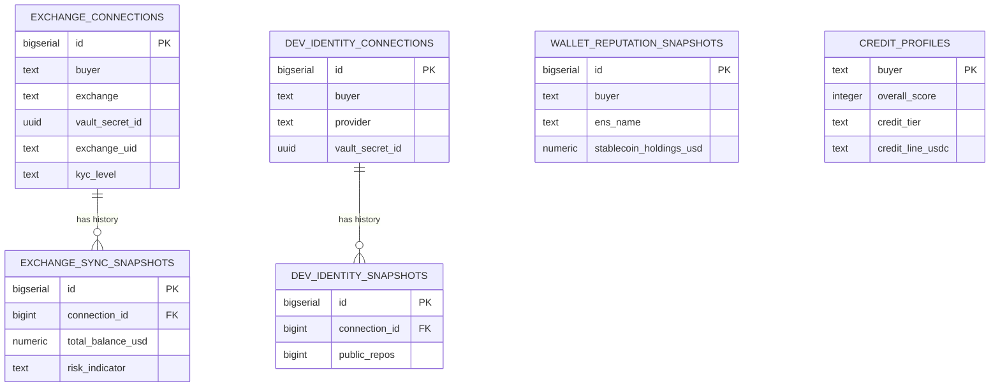
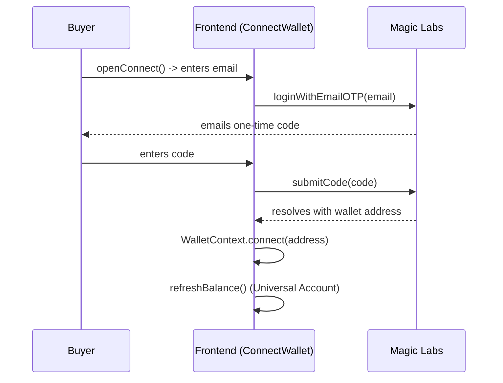
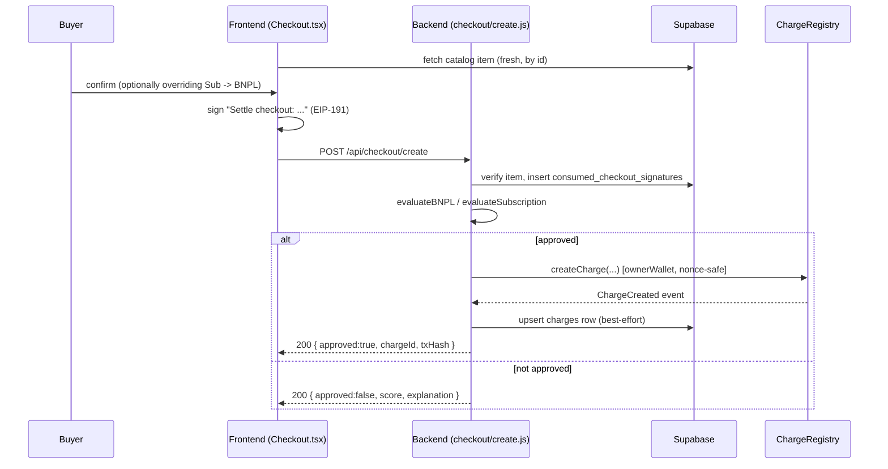
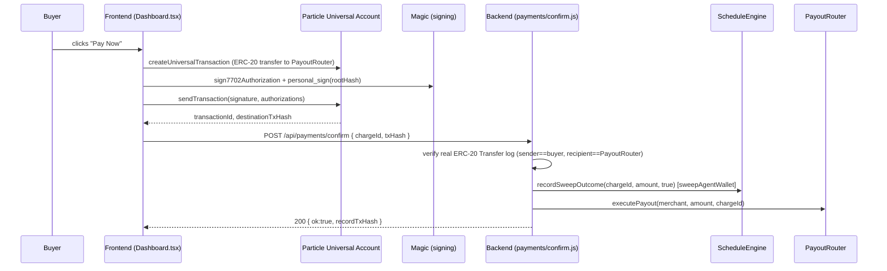
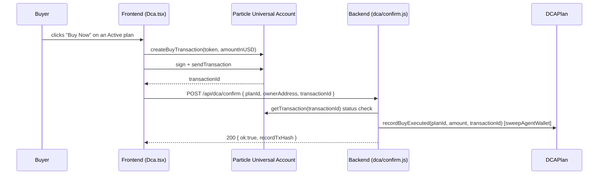
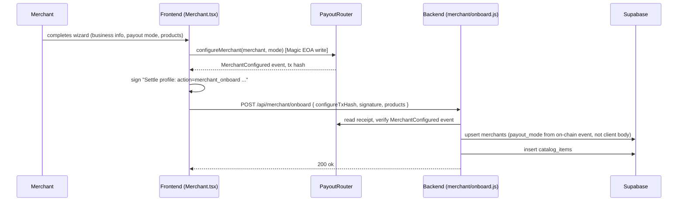

# Settle — Technical Documentation

**Cross-chain BNPL, subscriptions, and recurring DCA on Arbitrum, powered by Particle Network Universal Accounts (EIP-7702) and Magic Labs passwordless onboarding.**

This document is the official technical reference for developers, contributors, auditors, and technical reviewers. It is derived entirely from the current state of the codebase (contracts, backend, frontend, and Supabase schema) as of this writing. Where a claim could not be independently verified from the code, that is stated explicitly rather than assumed.

> **Scope note on secrets.** This document intentionally omits `.env` values, API keys, tokens, Vercel project configuration values, and any other credential or infrastructure secret. Smart contract addresses and the on-chain governance addresses cited below are public blockchain data (already published in `README.md` and verifiable on Arbiscan/Sourcify/Blockscout) and are included for that reason.

---

## Table of Contents

1. [Project Overview](#1-project-overview)
2. [Purpose and Vision](#2-purpose-and-vision)
3. [Core Features](#3-core-features)
4. [Architecture Overview](#4-architecture-overview)
5. [Technology Stack](#5-technology-stack)
6. [Folder and Project Structure](#6-folder-and-project-structure)
7. [Smart Contract Architecture](#7-smart-contract-architecture)
8. [Backend Architecture](#8-backend-architecture)
9. [API Reference](#9-api-reference)
10. [Database Schema and Relationships](#10-database-schema-and-relationships)
11. [AI Components](#11-ai-components)
12. [Authentication and Authorization](#12-authentication-and-authorization)
13. [State Management](#13-state-management)
14. [Frontend Architecture](#14-frontend-architecture)
15. [Data Flow and User Flows](#15-data-flow-and-user-flows)
16. [Business Logic](#16-business-logic)
17. [External Integrations](#17-external-integrations)
18. [Error Handling Strategy](#18-error-handling-strategy)
19. [Security Considerations](#19-security-considerations)
20. [Performance Optimizations](#20-performance-optimizations)
21. [Scalability Considerations](#21-scalability-considerations)
22. [Code Organization](#22-code-organization)
23. [Important Design Decisions](#23-important-design-decisions)
24. [Current Limitations](#24-current-limitations)
25. [Future Improvement Opportunities](#25-future-improvement-opportunities)
26. [Glossary](#26-glossary)

---

## 1. Project Overview

Settle is a full-stack, non-custodial payments application built around a real on-chain charge-and-repayment engine deployed on **Arbitrum One mainnet** (chain id `42161`). It lets a buyer:

- Buy now and pay later (BNPL) for a catalog item, in fixed installments;
- Subscribe to a recurring billing plan;
- Set up a recurring dollar-cost-averaging (DCA) purchase of any coin they hold; or
- Pay an arbitrary wallet address (not just an onboarded merchant) in installments.

Every plan is a real row in an on-chain `ChargeRegistry` contract, every approval decision comes from a real cross-chain underwriting signal, and every repayment or DCA buy is a real Particle Network Universal Account transaction — there is no simulated or mocked data path in the shipped product surfaces (catalog, checkout, dashboard, merchant, sweep history all read live on-chain or live Supabase state).

The project was built for Encode Club's UXmaxx Hackathon (Universal Accounts track), and ships an in-app `/docs` page mirroring the project's README for end users.

## 2. Purpose and Vision

Traditional BNPL and subscription products assume a single chain and a single balance. Settle's premise is that a buyer's real spending power is spread across many chains and many exchanges, and that a payments product should be able to use it wherever it sits — without asking the buyer to bridge funds, hold a specific chain's gas token, or manage a seed phrase.

Two pieces of infrastructure make this possible:

- **Particle Network Universal Accounts (EIP-7702)** let a buyer's existing wallet act as a single cross-chain account. A repayment or DCA buy can be funded from whichever chain the buyer's balance happens to be on, and settles to Arbitrum (or wherever the destination is configured), without a manual bridge step.
- **Magic Labs email one-time-code login** removes the seed-phrase/browser-extension requirement for onboarding — a buyer authenticates with an emailed code and gets an embedded EOA wallet.

Underwriting is designed around the same idea: rather than only looking at a single chain's transaction history, Settle's credit engine incorporates a real cross-chain balance signal (via Particle's `getTokens` RPC across 8 chains), and can optionally be strengthened by connecting exchange accounts and developer identities — always under a strict rule that additional signals can only **raise** a buyer's limit, never lower the on-chain-derived baseline.

## 3. Core Features

For each feature: **what** it does, **why** it exists, **how** it works internally, **which files** are responsible, and **how** it interacts with the rest of the system.

### 3.1 BNPL (Buy Now, Pay Later)

- **What**: A buyer selects a catalog item and pays for it in fixed installments instead of all at once.
- **Why**: Standard BNPL UX, but underwritten from real on-chain + cross-chain signals rather than a centralized credit bureau, and settled peer-to-protocol on a public ledger.
- **How it works internally**: The frontend collects a buyer's intent (item, installment count) and has the buyer sign an EIP-191 message binding the exact charge parameters. The backend independently re-derives the price from Supabase (never trusting a client-supplied price), runs the five-signal underwriting algorithm (`evaluateBNPL`), and — if approved and within the buyer's effective credit limit — calls `ChargeRegistry.createCharge` on-chain, signed by the backend's owner key (the only address the contract accepts for this call). Each subsequent installment is paid via a buyer-triggered Universal Account cross-chain transaction (see [Pay Now flow](#154-pay-now-cross-chain-installment-payment)); the `ScheduleEngine`/`PayoutRouter` contracts track cycle completion and route funds to the merchant.
- **Files**: `backend/api/checkout/create.js`, `backend/src/underwriting.js`, `backend/src/chargeCreation.js`, `contracts/src/ChargeRegistry.sol`, `contracts/src/ScheduleEngine.sol`, `contracts/src/PayoutRouter.sol`, `frontend/src/pages/Checkout.tsx`, `frontend/src/pages/Dashboard.tsx`, `frontend/src/lib/universalAccount.ts`.
- **Interactions**: Underwriting can be strengthened by a buyer's `credit_profiles` row (Identity & Credit Profile feature, §3.6) via `getEffectiveCreditLimit`. `LiquidityPool.frontCapital` (upfront capital fronting to the merchant) exists on-chain and is wired into the deployment, but is **not invoked anywhere in the shipped backend** — the live BNPL flow pays the merchant per completed cycle via `PayoutRouter.executePayout`, not upfront.

### 3.2 Subscriptions

- **What**: Recurring billing (`totalCycles = 0`, indefinite) on the same charge/repayment machinery as BNPL, with a lighter-weight risk gate.
- **Why**: Many merchant use cases (SaaS-style recurring billing) don't need full BNPL-grade underwriting, especially for low-value plans.
- **How it works internally**: `evaluateSubscription` in `backend/src/underwriting.js` short-circuits to an existence-only check (non-zero on-chain transaction count) for monthly amounts at or below a configurable threshold (`SUBSCRIPTION_RISK_THRESHOLD_USD`, default $50), skipping the full five-signal computation entirely. Amounts above the threshold run the full scoring algorithm, but against a **lower** approval bar (score ≥ 500) than BNPL's 580. A Subscription-tagged catalog item can also be overridden by the buyer to be paid via BNPL instead, with a bounded installment count (1–60 cycles).
- **Files**: `backend/src/underwriting.js` (`evaluateSubscription`), `backend/api/checkout/create.js`, `frontend/src/pages/Checkout.tsx`, `frontend/src/pages/Merchant.tsx` (subscriber list/dashboard).
- **Interactions**: Cancellation is available anytime from the buyer's dashboard (an on-chain `ChargeRegistry.setStatus` call path); subscriber counts feed `PayoutRouter`'s `subscriberCount` used in the merchant dashboard.

### 3.3 DCA (recurring cross-chain investing)

- **What**: Auto-invest a fixed USD amount into any coin the buyer holds, on a Weekly or Monthly schedule, sourced from whatever chain the buyer's balance sits on.
- **Why**: A second, distinct application of Universal Accounts beyond bill repayment — demonstrating that the same cross-chain-sourcing primitive generalizes to "pay yourself" flows, not just merchant payments.
- **How it works internally**: `DCAPlan.sol` only stores the schedule (`targetChainId`, `targetToken`, `amountPerCycleUSD`, `cycleSeconds`, `totalCycles`) and a record of executed buys — there is no counterparty to pay, so the purchased asset lands directly in the buyer's own account via `ua.createBuyTransaction()`. Plan creation/cancellation is a plain Arbitrum EOA transaction (no Universal Account involved); executing a buy cycle is the real cross-chain UA operation, confirmed server-side via Particle's transaction-status API (`UA_TRANSACTION_STATUS.FINISHED`) rather than an on-chain receipt check, since there's no settlement address to inspect for a Transfer log.
- **Files**: `contracts/src/DCAPlan.sol`, `frontend/src/pages/Dca.tsx`, `frontend/src/lib/universalAccount.ts` (`executeDcaBuy`), `frontend/src/lib/contracts.ts` (`createDcaPlan`/`cancelDcaPlan`), `backend/api/dca/confirm.js`.
- **Interactions**: The frontend's asset picker is built on Particle's `SUPPORTED_TARGET_TOKENS` registry; Solana is excluded from this specific picker (though reachable via the Account page's convert flow) because `DCAPlan.sol`'s on-chain `targetToken` field is a Solidity `address` and cannot hold a Solana account.

### 3.4 Pay Any Address

- **What**: The same underwriting and on-chain BNPL/subscription machinery as catalog checkout, but targeting an arbitrary wallet address instead of an onboarded merchant's catalog item.
- **Why**: Neither `ChargeRegistry.createCharge` nor `PayoutRouter.executePayout` require the recipient to be a registered merchant at the contract level — this feature exposes that generality in the UI, letting a buyer split a payment to any destination (a marketplace, a freelancer, another wallet) into fixed installments.
- **How it works internally**: A distinct backend endpoint (`checkout/create-direct.js`) validates an arbitrary recipient address and charge parameters (amount, cycle count, cycle period restricted to weekly/monthly), requires an EIP-191 signature covering every charge-defining field (since there's no catalog row to authoritatively pin values server-side), and shares its nonce-safe on-chain transaction sender with catalog checkout via `backend/src/chargeCreation.js`.
- **Files**: `backend/api/checkout/create-direct.js`, `frontend/src/pages/PayAnyAddress.tsx`.
- **Interactions**: Uses the identical underwriting (`evaluateBNPL`/`evaluateSubscription`) and effective-credit-limit logic as catalog checkout.

### 3.5 Universal Account page

- **What**: `/account` renders the buyer's full Universal Account balance broken down by chain and asset, plus a convert form that moves value into any supported token/chain pair.
- **Why**: The Dashboard previously only showed a single collapsed total; this page surfaces the data the SDK already returns via `getUnifiedBalance()`/`getPrimaryAssets()` in full.
- **How it works internally**: `WalletContext` lazily loads `lib/universalAccount.ts` (kept out of the main bundle for anonymous visitors) and calls `getUnifiedBalance(address)` on connect and on demand. The convert form calls `createConvertTransaction()`, which — unlike the DCA picker — includes Solana as a valid destination, since a conversion has no on-chain Solidity-side target-token constraint.
- **Files**: `frontend/src/pages/Account.tsx`, `frontend/src/lib/universalAccount.ts`, `frontend/src/context/WalletContext.tsx`.

### 3.6 Identity & Credit Profile

- **What**: A buyer can connect exchange accounts (Binance, Bybit, OKX, Gate.io, Bitget) via a read-only API key, and a GitHub/GitLab developer-identity account, to strengthen their credit profile.
- **Why**: None of the five supported exchanges offer self-serve OAuth to third-party developers, so a read-only API key is the only integration path available; connecting these accounts (plus an always-on wallet-reputation signal) lets a buyer unlock a higher credit limit than the base on-chain signal alone would produce.
- **How it works internally**: Connected signals (exchange balance/trade history/UID/KYC level, dev-account age/repo count, wallet reputation) feed `getEffectiveCreditLimit()`, which blends them into the base underwriting limit under a strict **raise-never-lower** guarantee (`max(profileLimit, baseLimit)`). Each connected exchange also has a live, uncached "View Account Details" page.
- **Files**: `backend/src/exchangeSync.js`, `backend/src/exchanges/*.js`, `backend/src/devIdentity.js`, `backend/src/walletReputation.js`, `backend/src/creditProfileEngine.js`, `frontend/src/pages/Profile.tsx`, `frontend/src/pages/ExchangeDetails.tsx`.
- **Interactions**: See §16.2 for the exact scoring formula and §10 for the underlying Supabase tables (`exchange_connections`, `dev_identity_connections`, `credit_profiles`, etc.).

### 3.7 Card (Coming Soon)

- **What**: A "Card" tab on `/profile`, explicitly labeled "Soon."
- **Why**: A placeholder for a planned future virtual-card product.
- **How it works internally**: Purely a static UI teaser — no backend endpoint, no on-chain component. This should not be described as a working feature.
- **Files**: `frontend/src/pages/Profile.tsx` (`CardTab` component).

### 3.8 Merchant onboarding

- **What**: A wizard that registers a merchant's payout configuration and initial catalog items.
- **Why**: Merchants need a way to declare how they get paid (`PayoutRouter.configureMerchant`) and to publish sellable items, without giving the backend custody of that on-chain call.
- **How it works internally**: The merchant's own Magic wallet calls `PayoutRouter.configureMerchant()` directly (a plain EOA write — the backend is not involved in this transaction). The onboarding endpoint then independently re-verifies the resulting `MerchantConfigured` event on-chain (parsing the transaction receipt) before writing the merchant profile and catalog items to Supabase, and requires an EIP-191 signature proving the caller controls `merchantAddress` in addition to that on-chain check.
- **Files**: `backend/api/merchant/onboard.js`, `frontend/src/pages/Merchant.tsx`, `contracts/src/PayoutRouter.sol`.

### 3.9 Onboarding & UX

- Magic Labs email one-time-code login (no password, no seed phrase).
- Light/dark theme toggle (persisted per-browser via `localStorage`).
- Sidebar collapse (desktop) persisted the same way; a full-drawer overlay on mobile.
- Professional in-app `/docs` page with sticky section navigation.

## 4. Architecture Overview



Three deployable units exist: the **frontend** (static SPA), the **backend** (Vercel serverless functions + cron), and the **contracts** (deployed once to Arbitrum One, then governed via the timelock). **Supabase** is a fourth, shared dependency used both as an off-chain read cache (catalog, sweep/payout history) and as the backend's own operational store (nonce allocation, anti-replay tables, encrypted credentials, credit profiles).

## 5. Technology Stack

| Layer | Technology | Notes |
|---|---|---|
| Smart contracts | Solidity `0.8.24`, Foundry | Optimizer enabled (200 runs), fuzz runs = 256 (`contracts/foundry.toml`) |
| Contract libraries | OpenZeppelin Contracts `5.6.1` | `Ownable2Step`, `Pausable`, `ReentrancyGuard`, `SafeERC20`, `TimelockController` |
| Chain | Arbitrum One (mainnet, chain id `42161`) | USDC (6 decimals) is the sole settlement asset on-chain |
| Frontend framework | React `19.2.7`, Vite `8.1.0`, TypeScript | Route-level code splitting via `React.lazy` |
| Frontend styling | Tailwind CSS v4 | Class-based dark mode toggle |
| Frontend routing | React Router `v7` (`BrowserRouter`) | Layout-route pattern for shared chrome |
| Frontend on-chain reads | `viem 2.53.1` | `publicClient` against Arbitrum |
| Frontend on-chain writes | `ethers 6.13.4` | Plain EOA writes (Magic signer) and message signing |
| Wallet/auth | `magic-sdk 33.9.0` (Magic Labs) | Email OTP login, embedded EOA, `personal_sign`, EIP-7702 authorization signing |
| Cross-chain execution | `@particle-network/universal-account-sdk 1.0.24` | Universal Accounts (EIP-7702 mode) |
| Off-chain data | `@supabase/supabase-js` | Anon key (public-read RLS) on the frontend; service-role key on the backend |
| Backend runtime | Node.js ≥ 20, ES modules (`"type": "module"`) | Deployed as Vercel serverless functions (Web-standard `Request`/`Response`) |
| Backend chain writes | `ethers v6` | Two backend-held wallets: owner key (charge creation) and sweep-agent key (settlement) |
| AI | `openai` npm client pointed at Zhipu's GLM endpoint | Not Anthropic Claude — see [§11](#11-ai-components) |
| Exchange integrations | `@binance/connector`, `bybit-api`, `okx-api`, `gate-api`, `bitget-api` | Mixed official/community SDKs, read-only API keys only |
| Database | Supabase Postgres, `pg_cron`, `pg_net`, Supabase Vault | 18 tables, RLS on all of them |

**Note on an unused dependency**: `@tanstack/react-query` is declared in `frontend/package.json` but is not imported or used anywhere in `frontend/src` (verified via repo-wide search). It plays no role in the app's actual state-management pattern — see [§13](#13-state-management).

## 6. Folder and Project Structure

```
settle/
├── contracts/                  Foundry project
│   ├── src/                    ChargeRegistry, ScheduleEngine, PayoutRouter,
│   │                           LiquidityPool, DefaultHandler, DCAPlan
│   ├── script/                 Deploy.s.sol, DeployDCA.s.sol (+ redeploy scripts)
│   └── test/                   Settle.t.sol, DCAPlan.t.sol (62 tests total)
│
├── frontend/                   Vite + React 19 + TypeScript, Tailwind v4
│   ├── src/pages/               Landing, Dashboard, Account, Profile, ExchangeDetails,
│   │                           Catalog, Checkout, Dca, PayAnyAddress, Merchant, Docs, NotFound
│   ├── src/lib/                 contracts.ts (viem reads + ethers writes),
│   │                           universalAccount.ts (Particle UA), magic.ts,
│   │                           api.ts, supabase.ts, format.ts, exchanges.tsx, creditLimit.ts
│   ├── src/components/          Layout, Sidebar (inside Layout), ConnectWallet,
│   │                           ThemeSwitcher, SettleLogo, ErrorBoundary
│   ├── src/context/             WalletContext.tsx
│   ├── vercel.json / netlify.toml
│
├── backend/                    Node scripts + Vercel serverless functions
│   ├── src/                     config.js, abis.js, buyerAuth.js, errors.js, http.js,
│   │                           rateLimit.js, nonceManager.js, chargeCreation.js,
│   │                           underwriting.js, creditProfileEngine.js, creditProfileSync.js,
│   │                           devIdentity.js, walletReputation.js, particleBalances.js,
│   │                           exchangeSync.js, sweepAgent.js, payoutExecutor.js
│   ├── src/exchanges/           binance.js, bybit.js, okx.js, gateio.js, bitget.js, common.js
│   ├── api/cron/                sweep.js, sync-profiles.js
│   ├── api/checkout/            create.js, create-direct.js
│   ├── api/payments/            confirm.js
│   ├── api/dca/                 confirm.js
│   ├── api/merchant/            onboard.js
│   ├── api/profile/             get.js, exchange.js (consolidated), identity.js (consolidated)
│   ├── api/dashboard.js          status page served at "/"
│   ├── dev-server.js             local-only shim replicating Vercel routing
│   └── vercel.json               regions, crons, rewrites, function config
│
└── supabase/
    ├── migrations/               001–017 (schema, RLS, extensions, cron, nonce allocator,
    │                            anti-replay tables, credit-profile schema, rate limiting)
    └── functions/index-events/   Deno edge function, on-chain event indexer
```

## 7. Smart Contract Architecture

Six Solidity `0.8.24` contracts, deployed on Arbitrum One and verified on Arbiscan, Sourcify, and Blockscout.

| Contract | Deployed address | Responsibility |
|---|---|---|
| `ChargeRegistry` | `0x9ee48583EafCcC2cdaB8Ae321B3e350244d0efBC` | Source of truth for BNPL/subscription charge state |
| `ScheduleEngine` | `0x9394f6f8a46828583a207D0b208bBe5d23934646` | Due-date tracking, sweep-outcome recording, grace/default state machine |
| `PayoutRouter` | `0xA1B8dB68E45eAE8ed7420311677aB5b139B9592C` | Merchant settlement, protocol fee split, merchant self-configuration |
| `LiquidityPool` | `0xC206CE3881A949c1E00F9ed276C9aDe5C1dEDe25` | Would front BNPL capital to merchants (deployed, wired, **not currently invoked** by the shipped backend) |
| `DefaultHandler` | `0x8E502651a456757001e98a32b97036FD73D871Ce` | Default tracking and BNPL access gating |
| `DCAPlan` | `0x869CbDA19fbD110A82eeAAb3fe1150945528Fe12` | Recurring investment schedule + buy-outcome recording |

### 7.1 `ChargeRegistry`

The core state machine. A `Charge` struct holds `buyer`, `merchant`, `chargeType` (`BNPL` or `Subscription`), `amountPerCycle`, `totalCycles`, `cyclesCompleted`, `cycleSeconds`, `nextDueAt`, `scoreAtIssuance`, `status`, and `createdAt`. `status` is one of `Active`, `Completed`, `Cancelled`, `Defaulted`.

- `createCharge(...)` is `onlyOwner` (the backend's owner key is the sole caller) and, for BNPL charges, additionally enforces `DefaultHandler.canAccessBNPL()` **on-chain** before creating the charge — not merely as an off-chain check in the underwriting service.
- `setStatus(chargeId, newStatus)` includes a guarded call into `ScheduleEngine.resetGraceState(chargeId)` when a charge transitions from `Defaulted` back to `Active` (a manual reinstatement), so a reinstated buyer gets a fresh grace period instead of immediately re-defaulting on the next missed cycle.
- Buyer and merchant charge lookups (`getBuyerCharges`, `getMerchantCharges`) are backed by indexed-array mappings (`buyerChargeIds`, `merchantChargeIds`) for O(1) retrieval rather than scanning every charge.
- Admin surface: `setScheduleEngine`, `setDefaultHandler` — both emit events for indexer observability.

### 7.2 `ScheduleEngine`

`recordSweepOutcome(chargeId, amount, success)` is the entry point for both real repayment confirmations and cron-driven "no payment happened" reports:

- **On success**: resets `failedAttempts`/`inGrace`/`graceStartedAt` to zero/false and calls `ChargeRegistry.markCycleComplete(chargeId)`.
- **On failure, first miss**: starts a grace period (`inGrace = true`, `graceStartedAt = now`), emits `GraceStarted`.
- **On failure, grace period already expired** (`gracePeriod = 3 days` by default): calls `ChargeRegistry.setStatus(chargeId, Defaulted)`, emits `ChargeFlaggedDefault`, then calls `DefaultHandler.flagDefault(...)` wrapped in a `try/catch` — so a reverting or misconfigured `DefaultHandler` can never block the primary charge-status transition.
- `resetGraceState(chargeId)` (callable by the owner or by `ChargeRegistry` itself) clears `inGrace`/`graceStartedAt`/`failedAttempts` and emits `GraceStateReset` — used on manual charge reactivation (§7.1).



*Note: "Grace" above is a sub-state of `Active` tracked via `ScheduleEngine`'s `inGrace` flag, not a distinct value of `ChargeRegistry.Status` — the on-chain `Status` enum only has `Active/Completed/Cancelled/Defaulted`.*

### 7.3 `PayoutRouter`

- `executePayout(merchant, amount, chargeId)` cross-checks the merchant and amount against the real `ChargeRegistry` charge (rather than trusting the caller's arguments blindly) and enforces a cycle-aware replay guard via `lastPaidCycle[chargeId]`, preventing a double-payout for the same billing cycle.
- `configureMerchant(merchant, mode)` is callable by the merchant themselves or the owner — merchants self-register their payout mode without backend involvement in that specific transaction.
- Protocol fee: `protocolFeeBps = 250` (2.5%), hard-capped at `MAX_FEE_BPS = 1000` (10%).
- `SubscriberCountChanged` event fires on every increment/decrement of a merchant's subscriber count.
- Gated by `Pausable`; a pause blocks payout execution but is deliberately not applied to `LiquidityPool.withdraw`, so depositor funds can never be trapped by a pause.

### 7.4 `LiquidityPool`

Would front BNPL capital directly to merchants and later reconcile against buyer repayments. `frontCapital()`/`recordRepayment()` are validated against a real, matching, active BNPL charge. **This flow is deployed and wired but is not called anywhere in the shipped backend** — the live product pays merchants per completed cycle via `PayoutRouter.executePayout`, not via upfront pool-fronted capital. A previously-present accounting bug (`recordRepayment` double-counting repaid principal back into `totalDeposited`) has been fixed in source; see [§24](#24-current-limitations) for its deployment status.

### 7.5 `DefaultHandler`

- `flagDefault(buyer, chargeId, reason)` — sets `isDefaulted[buyer] = true`, increments `defaultCount[buyer]`, records a `DefaultRecord`.
- `resolveDefault(buyer)` — clears `isDefaulted`.
- `canAccessBNPL(buyer)` — returns `false` if `isDefaulted[buyer]` or `defaultCount[buyer] >= 3`; this is the on-chain gate `ChargeRegistry.createCharge` enforces for BNPL.
- `DefaultPenaltyUpdated` event on penalty-parameter changes.

### 7.6 `DCAPlan`

- `createPlan(targetChainId, targetToken, amountPerCycleUSD, cycleSeconds, totalCycles)`, `recordBuyExecuted(planId, amount, transactionId)`, `cancelPlan(planId)`.
- `getOwnerPlans(owner)` is backed by an `ownerPlanIds` indexed-array mapping for O(1) lookup (mirroring `ChargeRegistry`'s pattern, rather than an O(n) scan).
- Two-state status enum: `Active`/`Cancelled` (distinct from `ChargeRegistry.Status` — index 1 means something different in each contract, so the two should never be conflated).

### 7.7 Deployment and wiring sequence



### 7.8 Governance model

Ownership is split across two models, chosen per-contract by whether the contract is called synchronously in the checkout hot path:

- **`ChargeRegistry`** is owned by the deployer EOA (`0x81711D73893051e6cbE7C9d846b68F81F4dCeD93`). `createCharge()` is called synchronously by the backend on every checkout with no operational fallback, so it must stay behind a single fast-signing key rather than a timelock; its admin surface (`setScheduleEngine`, `setDefaultHandler`) is lower-stakes than fund-moving functions.
- **`ScheduleEngine`, `PayoutRouter`, `LiquidityPool`, `DefaultHandler`, `DCAPlan`** are owned by a `TimelockController` at `0x1D389a6b40FBf2aAa09f7CF61C8FEB8B541a6639` (`minDelay = 3600` seconds / 1 hour), with 4 addresses holding both `PROPOSER_ROLE` and `EXECUTOR_ROLE`: the deployer plus 3 co-signers. Any admin action on these 5 contracts requires `schedule()` → wait 1 hour → `execute()`.

All 6 contracts use OpenZeppelin's `Ownable2Step` (a mistyped `transferOwnership` cannot permanently brick admin control), and `PayoutRouter`/`LiquidityPool` additionally use `Pausable` circuit breakers (with LP withdrawals deliberately exempt).

### 7.9 Testing

`contracts/test/Settle.t.sol` (49 tests) and `contracts/test/DCAPlan.t.sol` (13 tests) — 62 tests total, passing as of the last verified `forge test` run. Foundry config: solc `0.8.24`, optimizer enabled at 200 runs, fuzz runs = 256 (`contracts/foundry.toml`).

## 8. Backend Architecture

The backend is a set of **Vercel serverless functions** under `backend/api/**/*.js`, each exporting Web-standard `GET`/`POST`/`OPTIONS` handlers that receive a `Request` and return a `Response`. There is no persistent server process in production — `backend/dev-server.js` is a local-only Node HTTP server (never deployed) that dynamically imports every file under `api/` and replicates `vercel.json`'s rewrites, so local development doesn't require a Vercel account.

### 8.1 Shared modules (`backend/src/`)

| Module | Responsibility |
|---|---|
| `config.js` | Central env loader; exports `provider` (ethers `JsonRpcProvider`), two wallets (`ownerWallet`, `sweepAgentWallet`), `supabaseAdmin` (service-role client), contract `ADDRESSES`. Fails fast (throws) on a missing required env var rather than silently falling back to a public RPC. |
| `abis.js` | Static human-readable ABI fragments for all 6 contracts. |
| `buyerAuth.js` | Shared EIP-191 signature verification for "profile"-style endpoints — see [§12](#12-authentication-and-authorization). |
| `errors.js` | `safeError(context, err, clientMessage)` — logs full detail server-side with a correlation id, returns only a safe client message. |
| `http.js` | Shared `json()`/`corsPreflight()` helpers — every route needs CORS since frontend and backend are separate Vercel projects on different origins. |
| `rateLimit.js` | `checkIpRateLimit` — IP-keyed rate limiting via an atomic Postgres RPC, independent of any attacker-controlled request field. |
| `nonceManager.js` | `sendWithNonce(wallet, send)` — generic nonce-safe transaction sender (allocate → send → on nonce-related failure, resync once against the chain and retry once more). |
| `chargeCreation.js` | Nonce-safe `ChargeRegistry.createCharge` sender, shared by both checkout endpoints. |
| `underwriting.js` | Five-signal on-chain credit scoring — see [§16.1](#161-five-signal-underwriting-algorithm). |
| `creditProfileEngine.js` | Richer, additive credit profile (exchange/dev-identity/wallet-reputation signals) — see [§16.2](#162-credit-profile-engine-and-raise-never-lower-blending). |
| `creditProfileSync.js` | Background re-sync of every connected exchange/dev-identity account across all buyers. |
| `devIdentity.js` | GitHub/GitLab OAuth token exchange, profile fetch, state-binding verification. |
| `walletReputation.js` | ENS resolution, contract-interaction/NFT-activity counts (Etherscan V2), stablecoin holdings. |
| `particleBalances.js` | Cross-chain balance aggregation via Particle's `particle_getTokens` RPC across 8 chains. |
| `exchangeSync.js` | Dispatches to per-exchange adapters (`src/exchanges/*.js`) by name; connect/sync/disconnect/fetch-details orchestration. |
| `sweepAgent.js` | `settleCharge`, `processDueCharges` — the sweep/settlement state-machine driver (see §8.3). |
| `payoutExecutor.js` | `executePayout` (nonce-safe `PayoutRouter.executePayout` call); an alternative event-driven `startPayoutListener` mode exists but is **not wired into any Vercel route or cron** — only used if run as a standalone persistent process. |

### 8.2 Nonce management

Two backend-held wallets sign on-chain transactions: `ownerWallet` (charge creation only) and `sweepAgentWallet` (settlement, DCA-buy recording, cron sweeps). Because Vercel serverless functions are stateless and can execute concurrently, a naive `getTransactionCount("pending")` nonce lookup races under concurrent requests. `nonceManager.js`'s `sendWithNonce` instead:

1. Calls Postgres RPC `alloc_nonce(wallet)` — atomically increments a per-wallet counter row and returns the pre-increment value.
2. Sends the transaction with that nonce.
3. On a nonce-related failure (`"nonce"`, `"replacement"`, or `"already known"` in the error message), reads the chain-derived nonce floor (`getTransactionCount(..., "latest")`), calls `resync_nonce(wallet, floor)` (which only ever moves the counter forward), and retries once.
4. Throws after 2 total attempts.

Both `ownerWallet` and `sweepAgentWallet` use this same mechanism (via `chargeCreation.js` and directly in `sweepAgent.js`/`payoutExecutor.js`/`dca/confirm.js` respectively).

### 8.3 Sweep / settlement state machine

The cron sweep path is **not** an automated fund-collection mechanism — Particle's Universal Account SDK has no session-key, delegation, or spending-limit primitive, so a backend service cannot pre-authorize or sign a cross-chain transfer on a buyer's behalf. Every real fund movement is buyer-triggered. What the cron does instead:

- `processDueCharges()` iterates all charges, and for any `Active` charge past its `nextDueAt`, reports the *absence* of payment via `settleCharge(chargeId, 0, false)` — which drives the grace-period/default transitions described in [§7.2](#72-scheduleengine).
- The real repayment path is `api/payments/confirm.js`, called by the frontend only **after** a buyer has completed a real cross-chain Universal Account transfer; the backend independently verifies the on-chain ERC-20 `Transfer` log before calling `settleCharge(chargeId, amount, true)`.

### 8.4 Route consolidation and Vercel configuration

`backend/vercel.json` pins execution to the `fra1` (Frankfurt) region — chosen because at least one integrated exchange (Binance) blocks requests from US-region IPs (HTTP 451), and Vercel's default/other regions triggered that block in production. Several logically distinct external routes are consolidated into fewer physical files via `rewrites`, to stay within Vercel's Hobby-plan 12-serverless-function-per-deployment cap:

```json
{
  "regions": ["fra1"],
  "crons": [
    { "path": "/api/cron/sweep", "schedule": "0 0 * * *" },
    { "path": "/api/cron/sync-profiles", "schedule": "0 12 * * *" }
  ],
  "rewrites": [
    { "source": "/", "destination": "/api/dashboard" },
    { "source": "/api/profile/exchange/:action", "destination": "/api/profile/exchange?action=:action" },
    { "source": "/api/profile/dev-identity/disconnect", "destination": "/api/profile/identity" },
    { "source": "/api/profile/github/callback", "destination": "/api/profile/identity?provider=github" },
    { "source": "/api/profile/gitlab/callback", "destination": "/api/profile/identity?provider=gitlab" }
  ]
}
```

Both cron jobs run **once daily** (Hobby-plan limitation — Vercel's free tier only permits daily-or-coarser cron schedules; a Pro-plan upgrade would allow the sweep job to run every few minutes, closer to real-time grace/default detection). `GET /` is rewritten to a status-dashboard endpoint (`api/dashboard.js`) that reports live on-chain reads, Supabase connectivity, and boolean-only configuration status (never a secret value) — see [§9](#9-api-reference).

## 9. API Reference

All endpoints return JSON via a shared `json()` helper (with permissive CORS headers, since frontend and backend are separate origins) and answer `OPTIONS` with a 204 CORS preflight.

| Method | Path | Auth | Rate limit | Purpose |
|---|---|---|---|---|
| `POST` | `/api/checkout/create` | EIP-191 (bespoke `Settle checkout: ...` message, inline-verified) | 5 / 5 min per buyer (DB-backed) | Catalog-item BNPL/subscription charge creation |
| `POST` | `/api/checkout/create-direct` | EIP-191 (bespoke `Settle direct pay: ...` message) | 5 / 5 min per buyer (DB-backed) | "Pay Any Address" charge creation |
| `POST` | `/api/payments/confirm` | None (on-chain ERC-20 Transfer-log proof) | Per-IP + per-charge | Confirms a buyer's real cross-chain repayment |
| `POST` | `/api/dca/confirm` | None (Particle transaction-status proof) | Per-IP | Confirms a buyer's real DCA buy |
| `POST` | `/api/merchant/onboard` | EIP-191 (`buyerAuth.js`, action=`merchant_onboard`) + on-chain `MerchantConfigured` event check | Per-IP | Registers a merchant + initial catalog items |
| `POST` | `/api/profile/get` | EIP-191 (`buyerAuth.js`, action=`get_profile`) | — | Returns full credit profile, wallet reputation, connections |
| `POST` | `/api/profile/exchange/connect` | EIP-191 (action=`connect_exchange`) | — | Links a read-only exchange API key |
| `POST` | `/api/profile/exchange/sync` | EIP-191 (action=`sync_exchange`) | 30s cooldown per buyer/exchange | Re-syncs one connected exchange |
| `POST` | `/api/profile/exchange/details` | EIP-191 (action=`exchange_account_details`) | Per-IP | Live, uncached account details (no persistence) |
| `POST` | `/api/profile/exchange/disconnect` | EIP-191 (action=`disconnect_exchange`) | — | Deletes a connected exchange's stored credential |
| `GET` | `/api/profile/github/callback` / `/api/profile/gitlab/callback` | OAuth `state` re-verified server-side against a prior EIP-191 signature | — | Dev-identity OAuth callback |
| `POST` | `/api/profile/dev-identity/disconnect` | EIP-191 (action=`disconnect_dev_identity`) | — | Disconnects a GitHub/GitLab connection |
| `GET` | `/api/cron/sweep` | `Authorization: Bearer <CRON_SECRET>` (constant-time compare, fail-closed) | — | Grace/default state-machine driver (daily) |
| `GET` | `/api/cron/sync-profiles` | Same as above | — | Refreshes cached credit profiles (daily) |
| `GET` | `/` | None (public) | — | Live status dashboard (on-chain reads, Supabase connectivity, route list, boolean credential status) |

### 9.1 Signature message formats

| Message template | Used by |
|---|---|
| `Settle profile: action=<action> buyer=<buyer> ts=<ts>` | `profile/get`, `profile/exchange` (all 4 actions), `profile/identity` (disconnect + OAuth state binding), `merchant/onboard` |
| `Settle checkout: catalogItemId=<id> buyer=<addr> chargeType=<0|1> totalCycles=<n> ts=<ts>` | `checkout/create` (inline-verified, binds the resolved charge parameters) |
| `Settle direct pay: merchant=<addr> type=<chargeType> amount=<amountPerCycle> cycles=<totalCycles> period=<cycleSeconds> buyer=<addr> ts=<ts>` | `checkout/create-direct` |
| *(none — on-chain proof only)* | `payments/confirm` (ERC-20 Transfer log), `dca/confirm` (Particle transaction status) |

All signature-based endpoints share a 300-second freshness window.

### 9.2 Replay protection

| Table | Constraint | Protects |
|---|---|---|
| `consumed_checkout_signatures` | `PRIMARY KEY (buyer_address, catalog_item_id, ts)` | `checkout/create` |
| `consumed_direct_checkout_signatures` | `PRIMARY KEY (buyer_address, ts)` | `checkout/create-direct` |
| `consumed_payment_txs` | `PRIMARY KEY (tx_hash)` | `payments/confirm` |
| `consumed_dca_txs` | `PRIMARY KEY (transaction_id)` | `dca/confirm` |

Each table's uniqueness constraint is the actual concurrency lock (a replayed or concurrent duplicate request fails atomically on insert), not an application-level check.

## 10. Database Schema and Relationships

Supabase Postgres hosts 18 tables, all with RLS enabled. There is **no traditional users table** — identity throughout is the wallet address itself (lowercase hex text), used directly as a key/foreign-key value.

### 10.1 Entity relationships (core commerce tables)



`charges.buyer` has no FK target (there is no buyers table); `merchant_payouts.charge_id`/`merchant_payouts.merchant` are plain columns conceptually linked to `charges`/`merchants` by value, not enforced by a DB foreign key.

### 10.2 Identity & Credit Profile tables



`credit_profiles` has **no DB-level foreign key** into any of the signal tables above it — the aggregation happens in application code (`creditProfileEngine.js`), not enforced by the schema. `wallet_reputation_snapshots` has no connection/FK table at all, since it is derived purely from public on-chain data requiring no stored credential.

### 10.3 Anti-replay, nonce, and rate-limit tables

`consumed_checkout_signatures`, `consumed_direct_checkout_signatures`, `consumed_payment_txs`, `consumed_dca_txs` (see [§9.2](#92-replay-protection)); `nonce_alloc` (per-wallet nonce counter); `ip_rate_limits` (per-IP/per-endpoint attempt log, cleaned up by a `pg_cron` job every 15 minutes).

### 10.4 Row-Level Security

Exactly 5 tables have a public-read policy (`using (true)`, `SELECT` only, no write policy for `anon`/`authenticated` anywhere): `catalog_items`, `merchants`, `merchant_payouts`, `sweeps`, `charges`. The remaining **13 tables are fully default-deny** (RLS enabled, zero policies) — reachable only via the `service_role` key, which bypasses RLS and is used exclusively server-side.

### 10.5 Postgres functions

| Function | Purpose | Security note |
|---|---|---|
| `alloc_nonce(wallet)` | Atomically allocates the next transaction nonce for a backend wallet | `EXECUTE` revoked from `anon`/`authenticated`; `search_path` pinned |
| `resync_nonce(wallet, floor)` | Forward-only resync against a chain-derived nonce floor | Same |
| `update_merchant_totals(...)` | Additive upsert into `merchants`' running totals, called by the indexer | Same |
| `check_and_consume_ip_rate_limit(ip, endpoint, max, window)` | Atomic (advisory-lock-serialized) rate-limit check-and-insert | Same |
| `store_encrypted_credential` / `read_encrypted_credential` / `delete_encrypted_credential` | Wraps Supabase Vault (`vault.create_secret`/`vault.decrypted_secrets`) for exchange API keys and OAuth tokens | `SECURITY DEFINER`; `EXECUTE` revoked from `anon`/`authenticated` |

### 10.6 `index-events` edge function

A Deno edge function, invoked every 5 minutes via `pg_cron` + `pg_net`, polls `ChargeCreated`/`CycleCompleted`/`ChargeStatusChanged` (`ChargeRegistry`), `SweepTriggered`/`GraceStarted`/`ChargeFlaggedDefault` (`ScheduleEngine`), and `PayoutExecuted`/`MerchantConfigured` (`PayoutRouter`) events, upserting into the corresponding Supabase tables. `LiquidityPool` events (unused feature) and `DCAPlan` events (read live on-chain by the frontend instead) are explicitly not indexed. Idempotency is enforced via a unique `(tx_hash, log_index)` constraint on `sweeps`/`merchant_payouts`, so a re-scanned overlapping block range is a no-op rather than a duplicate.

## 11. AI Components

Settle uses **Zhipu's GLM** model (via an OpenAI-compatible client, default `glm-4.6`) — not Anthropic Claude — to generate a short, plain-language explanation for **borderline BNPL underwriting decisions only** (credit score in the `[540, 640)` band, straddling the 580 approval threshold). The approval decision itself is entirely score-based and does not depend on the LLM call; if the GLM call fails for any reason, the explanation falls back to an empty string and the checkout flow proceeds unaffected. Subscription approvals never generate an AI explanation. This is implemented in `backend/src/underwriting.js`.

## 12. Authentication and Authorization

Settle has no session/cookie-based auth anywhere. Two distinct mechanisms are used depending on the endpoint:

1. **EIP-191 (`personal_sign`) signature verification** — the buyer's Magic-managed wallet signs a short, deterministic message (see [§9.1](#91-signature-message-formats)) that the backend re-derives and verifies via `ethers.verifyMessage`, checking a 300-second freshness window. `src/buyerAuth.js` implements the common `Settle profile: ...` pattern used by most "profile" endpoints; checkout endpoints use a bespoke inline verification so the signed payload can bind charge-specific fields.
2. **On-chain proof** — `payments/confirm` and `dca/confirm` require no signature at all; the proof of buyer action is a real, independently-verified on-chain transaction (an ERC-20 `Transfer` log, or Particle's own transaction-status API).

**GitHub/GitLab OAuth** (for the dev-identity credit signal) uses a signed `state` parameter: the buyer first signs a `connect_github`/`connect_gitlab` action message, and the resulting `{buyer, provider, ts, signature}` tuple is base64url-encoded as the OAuth `state`. The callback handler re-verifies that signature server-side before trusting the state-derived buyer address — preventing an attacker from completing their own OAuth flow and injecting someone else's wallet address.

Login itself is via **Magic Labs' email one-time-code flow** (`magic.auth.loginWithEmailOTP`), which provisions an embedded EOA wallet; there is no separate password.

## 13. State Management

There is **no global state library** (no Redux/Zustand/Jotai/MobX, and — despite being a declared dependency — `@tanstack/react-query` is not used anywhere in `frontend/src`). The actual pattern is:

- **One React Context** (`WalletContext`) for genuinely cross-cutting state: the connected `address`, the Universal Account `balance`, `uaConfigured`, and an `openConnect()` trigger for a single root-level login modal.
- **Local component state everywhere else** — every page manages its own data-fetching state (`loading`/`error`/fetched data) independently via `useState`/`useEffect`, re-fetching from Supabase, viem, or the backend API on mount or on address change. There is no shared caching layer between pages (e.g., Dashboard and Profile each independently fetch charges rather than sharing a cache).
- A small number of custom hooks encapsulate repeated logic — notably `useAvailableBnplCredit` (`lib/creditLimit.ts`).
- `localStorage` is used directly (no wrapper) for two persisted UI preferences: theme (`settle-theme`) and sidebar-collapse state (`settle-sidebar-collapsed`).

## 14. Frontend Architecture

### 14.1 Routing

| Path | Page | Inside shared `Layout` chrome? |
|---|---|---|
| `/` | Landing | No |
| `/dashboard` | Dashboard | Yes |
| `/account` | Account | Yes |
| `/profile` | Profile | Yes |
| `/profile/exchange/:exchange` | ExchangeDetails | Yes |
| `/catalog` | Catalog | Yes |
| `/checkout/:id` | Checkout | Yes |
| `/dca` | Dca | Yes |
| `/pay` | PayAnyAddress | Yes |
| `/merchant` | Merchant | Yes |
| `/docs` | Docs | Yes |
| `*` | NotFound | No |

Every page except the shell itself is lazy-loaded (`React.lazy`), so heavy dependencies (ethers, viem, magic-sdk, the Particle SDK, recharts, `supabase-js`) only load for the route that needs them — the initial bundle is just the shell, theme, and Magic.

### 14.2 `WalletContext` (the app's only shared state)

Exposes `address`, `balance`, `balanceLoading`, `uaConfigured`, `connect(address)`, `disconnect()`, `refreshBalance()`, and `openConnect()`. On mount, it attempts a silent session restore via Magic (`magic.user.isLoggedIn()`); `lib/universalAccount.ts` is dynamically imported (not statically bundled) to keep Particle's SDK weight out of every visitor's initial download. The single `ConnectWallet` login modal lives at the app root (rendered by the provider itself), so any component anywhere can trigger it via `openConnect()`.

### 14.3 Key `lib/` modules

- **`contracts.ts`** — viem `publicClient` + reads (`getProtocolStats`, `getBuyerCharges`, `getOwnerDcaPlans`, `getMerchantStats`, `getMerchantSubscriptionCharges`) and ethers-based plain EOA writes (`createDcaPlan`, `cancelDcaPlan`, `configureMerchantPayout`).
- **`universalAccount.ts`** — Particle Universal Account integration: `payChargeCycleCrossChain` (BNPL/subscription installment payment), `executeDcaBuy`, `convertAsset`, plus balance/metadata helpers. All three operation builders share a `submitUaTransaction` path: acquire EIP-7702 authorizations (via Magic's `wallet.sign7702Authorization`), sign the root hash (`personal_sign`), then `ua.sendTransaction`.
- **`api.ts`** — typed wrappers around every backend endpoint, including the shared `signProfileAction` helper that implements the `Settle profile: action=...` message pattern.
- **`magic.ts`** — Magic SDK singleton, email-OTP login flow, login-error classification.
- **`creditLimit.ts`** — `outstandingBnplPrincipal()` and the `useAvailableBnplCredit()` hook underlying the "Available BNPL Credit" UI (§3.6).
- **`format.ts`** — USDC/address/timestamp formatting, status-label/color maps (careful to keep `ChargeRegistry`'s 4-state map distinct from `DCAPlan`'s 2-state map).

### 14.4 Components

`Layout` (sidebar + mobile drawer + header, wraps all authenticated routes), `ConnectWallet` (login modal), `ErrorBoundary` (class component catching render-time exceptions anywhere in the routed tree, falls back to a full reload rather than a client-side nav), `ThemeSwitcher`, `SettleLogo`.

## 15. Data Flow and User Flows

### 15.1 Login (Magic email OTP)



### 15.2 Catalog checkout -> on-chain charge creation



### 15.3 Pay Now — cross-chain installment payment



### 15.4 DCA buy execution



### 15.5 Merchant onboarding



## 16. Business Logic

### 16.1 Five-signal underwriting algorithm

`backend/src/underwriting.js::computeCreditScore` combines five weighted signals (weights sum to 100):

| Signal | Weight | Computation |
|---|---|---|
| Wallet age | 20 | `min(txCount / 500, 1) * 20`, using Arbitrum transaction count as a proxy |
| Repayment history | 30 | `(completedCharges / totalCharges) * 30`; a buyer with zero prior charges gets a 15-point baseline ("unknown = 50%") |
| Default history | 25 | `25 - min(defaultCount * 25, 25)` — a single default already zeroes this signal |
| Protocol diversity | 15 | If Particle cross-chain data is available: `(chainsWithBalance / chainsScanned) * 15`; else falls back to `min(txCount / 200, 1) * 15` |
| Balance consistency | 10 | If cross-chain data available: `min(totalNativeValue / 0.5 ETH-equivalent, 1) * 10`; else single-chain native balance |

The raw 0–100 sum is linearly mapped to a **300–850** score: `300 + (raw/100) * 550`.

- **BNPL**: approved if `score >= 580`; derived limit = linear interpolation of the 300–850 range onto **$0–$2,000** (USDC, 6 decimals). A GLM explanation is generated only for scores in `[540, 640)`.
- **Subscription**: if the monthly amount is at or below `SUBSCRIPTION_RISK_THRESHOLD_USD` (default $50), only an existence check runs (non-zero tx count) — full scoring is skipped entirely. Above that threshold, full scoring runs against a **lower** bar (`score >= 500`). No GLM explanation is ever generated for subscriptions.

### 16.2 Credit profile engine and raise-never-lower blending

`creditProfileEngine.js` computes an **additive, richer** profile that never replaces the base on-chain score used for checkout approval — it only lets a fuller profile *raise* the buyer's effective limit. Four weighted categories (on-chain history 35, wallet reputation 20, exchange activity 30, developer reputation 15) combine into the same 300–850 scale, with a credit-line cap of **$5,000** (vs. the base $2,000) "since a fuller profile justifies more headroom." `getEffectiveCreditLimit(buyer, baseLimit)` returns `max(profileLimit, baseLimit)` — a cached profile can only raise the checkout-time limit, never reduce it below the base 5-signal-derived amount.

### 16.3 BNPL vs. Subscription — summary of differences

| | BNPL | Subscription |
|---|---|---|
| Approval threshold | score ≥ 580 | score ≥ 500 (full scoring only above the risk threshold) |
| Full scoring always runs? | Yes | No — skipped for amounts ≤ threshold (default $50/mo) |
| Derived credit limit | Yes ($0–$2,000 base, up to $5,000 with a profile) | No — boolean approval only |
| GLM explanation | Yes, for borderline scores | Never |
| Cycle count | Fixed (`totalCycles > 0`) | Indefinite (`totalCycles = 0`) unless overridden to BNPL at checkout |

## 17. External Integrations

| Integration | Used for | Notes |
|---|---|---|
| **Particle Network** | Universal Accounts (EIP-7702 cross-chain execution), cross-chain balance signal (`particle_getTokens`, 8 chains) | The buyer's existing EOA becomes the Universal Account owner in place — no separate smart-account deployment |
| **Magic Labs** | Email OTP login, embedded EOA wallet, `personal_sign`, EIP-7702 authorization signing | The only login mechanism in the app |
| **Binance / Bybit / OKX / Gate.io / Bitget** | Read-only exchange signal (balance, trade count, account age, KYC where exposed) | Read-only API keys only; no self-serve OAuth exists for any of the five, hence the API-key model |
| **GitHub / GitLab OAuth** | Developer-identity credit signal (account age, repo/project count) | State-bound to a prior buyer signature to prevent identity-injection |
| **Zhipu GLM** | Borderline BNPL underwriting explanations | OpenAI-compatible endpoint; narrowly scoped, never affects the approval decision |
| **Etherscan V2 (multi-chain API)** | Wallet reputation: contract-interaction count, NFT activity count | Chain-scoped to Arbitrum for this app's usage |
| **Ethereum mainnet RPC** | ENS reverse resolution only | Separate from the Arbitrum RPC used for settlement, since ENS resolution is L1-only |

## 18. Error Handling Strategy

- **Never leak internal error detail to the client.** `src/errors.js::safeError` logs the full error server-side with a random correlation id and returns only `{ error: clientMessage, errorId }`.
- **Fail closed on cron auth.** The cron handlers reject with 401 if `CRON_SECRET` is unset, rather than allowing a guessable "Bearer undefined" bypass; the comparison itself is constant-time.
- **Fail open on IP rate limiting.** If the rate-limit RPC call itself errors (e.g. a Supabase hiccup), the check passes rather than blocking a legitimate payment/DCA confirmation — the real replay protection is the unique-constrained anti-replay tables, not this limiter.
- **Guarded cross-contract calls.** `ScheduleEngine`'s call into `DefaultHandler.flagDefault()` is wrapped in `try/catch` so a misconfigured or reverting `DefaultHandler` can never block the primary charge-status transition.
- **Independent per-check degradation on the status dashboard.** `api/dashboard.js` wraps every live check (RPC call, contract read, Supabase count) in a `safeCheck` helper so one failing dependency degrades only its own row rather than 500ing the whole page — consistent with the app's broader "no mock data, honest failure" pattern.
- **Frontend render-time errors** are caught by a root-level `ErrorBoundary` (class component), which shows a fallback and a full-page reload link rather than silently blanking the app.

## 19. Security Considerations

- **No mock data.** Every surface (catalog, checkout, merchant dashboard, sweep history, balances) reads from real on-chain state or real Supabase rows.
- **Backend never trusts client input for value-bearing actions.** `payments/confirm` re-checks the actual ERC-20 `Transfer` log and its sender (not just the claimed amount); `merchant/onboard` re-checks the actual `MerchantConfigured` event and derives `payoutMode` from the on-chain event args, not the request body; `checkout/create`/`create-direct` require a fresh EIP-191 signature and consume it exactly once via a DB-unique constraint; `dca/confirm` consumes each Particle `transactionId` exactly once for the same reason.
- **Key separation.** The owner/deployer key (signs `createCharge`) is distinct from the sweep-agent key (signs unattended cron-driven and buyer-confirmed settlements), so a compromise of one does not automatically expose the other's authority.
- **RLS as the actual security boundary**, not origin allowlisting — Supabase reads use the anon key with public-read RLS policies; all writes use the service-role key, server-side only.
- **Timelock + multisig governance** on 5 of 6 contracts (1-hour delay, 4-address multisig); `ChargeRegistry` is a deliberate, documented exception (see [§7.8](#78-governance-model) and [§23](#23-important-design-decisions)).
- **Accepted tradeoff — sweep-agent key concentration.** `ScheduleEngine.recordSweepOutcome` and `PayoutRouter.executePayout` trust the sweep-agent key's attestation without independent on-chain proof of a fund transfer in the cron path (a real transfer *is* independently verified for the buyer-initiated path via `payments/confirm`). This is a documented design tradeoff (off-chain attestation, on-chain record) rather than an oversight, and represents the single highest-value key in the system from a fund-drain-risk perspective.
- **No third-party security audit yet.** An internal audit pass identified and remediated a critical `LiquidityPool` accounting bug (dormant — the affected function is not invoked by the shipped backend), a merchant-onboarding authentication gap (fixed), a nonce-safety asymmetry between the two backend wallets (fixed), and several lower-severity issues. Before moving significant capital through `LiquidityPool`/`PayoutRouter`, an independent third-party audit is recommended.

## 20. Performance Optimizations

- **O(1) charge and DCA-plan lookups.** `ChargeRegistry.buyerChargeIds`/`merchantChargeIds` and `DCAPlan.ownerPlanIds` are indexed-array mappings, avoiding a full-table scan per lookup.
- **Route consolidation.** Several backend routes are physically merged (dispatched by an `?action=`/`?provider=` query parameter) to fit within Vercel's Hobby-plan function-count cap without sacrificing a clean external API shape.
- **Frontend route-level code splitting.** Every page is `React.lazy`-loaded, so heavy dependencies only load for the route that needs them.
- **Indexed Postgres queries.** Every anti-replay/nonce/rate-limit table has a supporting index for its access pattern (e.g., `idx_consumed_payment_txs_charge_created`), and the on-chain event indexer's dedup relies on a unique composite index rather than a slower existence-check pattern.

## 21. Scalability Considerations

- **Stateless, serverless backend.** Every API route is a Vercel serverless function with no in-memory state — horizontal scaling is automatic, but this is exactly why nonce management ([§8.2](#82-nonce-management)) and rate limiting needed to move into atomic Postgres operations rather than in-process counters.
- **Hobby-plan constraints (current deployment).** Cron jobs are limited to daily granularity, and the deployment is capped at 12 serverless functions — both addressed via schedule choice and route consolidation respectively. A Pro-plan upgrade would allow a near-real-time sweep cadence and remove the need for route consolidation.
- **Cross-chain balance scanning** (`particleBalances.js`) fetches all 8 configured chains in parallel per underwriting/profile computation — this is the main per-request latency and rate-limit surface for anything touching the credit engine.

## 22. Code Organization

- **Adapter pattern for exchange integrations.** Each exchange (`src/exchanges/{binance,bybit,okx,gateio,bitget}.js`) exports the identical `{ testConnection, fetchSignals }` shape; adding a new exchange means writing one adapter file and one line in `exchangeSync.js`'s `ADAPTERS` map — nothing else changes.
- **Shared cross-cutting helpers** (`http.js`, `errors.js`, `rateLimit.js`, `nonceManager.js`, `buyerAuth.js`) are imported by nearly every route, keeping CORS, error-shaping, rate-limiting, nonce-safety, and signature verification each implemented exactly once.
- **Two-layer credit logic.** `underwriting.js` (checkout-time approval, always on-chain-signal-only) is kept separate from `creditProfileEngine.js` (a richer, cached, additive profile) — the separation exists specifically so a slower/cache-dependent computation can never be on the critical path for a checkout approval decision.
- **Frontend `lib/` modules are organized by concern**, not by page: on-chain reads/writes (`contracts.ts`), cross-chain execution (`universalAccount.ts`), backend API calls (`api.ts`), auth (`magic.ts`), and pure formatting (`format.ts`) are each a single file reused across every page that needs them.

## 23. Important Design Decisions

- **`ChargeRegistry` is deliberately excluded from timelock governance.** `createCharge()` is called synchronously at checkout with no operational fallback — a 1-hour-delayed owner would break checkout outright. This was discovered the hard way (the timelock was originally deployed as owner of all 6 contracts, which immediately broke checkout; fixed by transferring `ChargeRegistry` ownership back to the deployer EOA through the timelock itself).
- **All cross-chain fund movements are buyer-triggered by necessity, not by choice.** Particle's Universal Account SDK (checked directly against its installed type definitions) has no session-key, delegation, or spending-limit API surface — every operation requires the buyer's own key to sign that specific transaction's root hash. This shapes the entire settlement architecture: the cron sweep path can only ever detect non-payment, never collect it.
- **Raise-never-lower credit blending.** A connected exchange/dev-identity/wallet-reputation profile can only increase a buyer's effective limit above the base on-chain score's limit, never decrease it — this avoids a scenario where connecting an account could ever be worse for a buyer than not connecting it.
- **`LiquidityPool`'s capital-fronting path is deployed but intentionally dormant** in the current backend — BNPL is paid per completed cycle via `PayoutRouter`, not fronted upfront, until the fronting path's accounting is fully proven out in production.
- **Subscription risk-gating by amount, not by buyer.** Low-value subscriptions skip full underwriting entirely, trading a small amount of default risk for meaningfully lower friction on low-stakes recurring billing.

## 24. Current Limitations

- **EIP-7702 authorization signing via Magic has not been confirmed live end-to-end.** The integration is built against Magic's documented `sign7702Authorization()` API and Particle's reference implementation, but a complete live run (real Particle project + real Magic project + domain allowlisting) had not fully completed as of the last verified state. This should be treated as *implemented but not independently confirmed working end-to-end in production*, not as untested code.
- **Unattended recurring auto-debit is not achievable with Particle's current SDK.** This is a hard SDK constraint (no delegation/session-key primitive exists), not an unbuilt feature — every cross-chain operation requires buyer-side signing.
- **The cron sweep path cannot itself collect funds** — it can only detect and record non-payment, driving the grace/default state machine; real settlement is always buyer-initiated.
- **`LiquidityPool`'s upfront-capital-fronting feature is deployed and wired but unused** by the shipped backend.
- **No third-party security audit has been performed.**
- **`ChargeRegistry` remains on a single deployer EOA** rather than the timelock/multisig used by the other 5 contracts, by design (see [§23](#23-important-design-decisions)) — this concentrates operational risk on that one key for charge-creation authority specifically.
- Full end-to-end operation of the cross-chain payment feature and the developer-identity signal additionally depends on Particle Network and GitHub/GitLab OAuth application credentials being configured in the deployment environment; this document does not track whether any specific deployment currently has them set, since that is environment configuration, not application code.

## 25. Future Improvement Opportunities

- **Activate `LiquidityPool` capital-fronting** now that its accounting bug is fixed in source, once deployed and re-verified — this would let merchants get paid upfront rather than per completed cycle.
- **Operator-role redesign for `ChargeRegistry`**, separating "who can create charges" from "who governs contract configuration," which would remove the current single-EOA exception from the timelock model without breaking checkout latency.
- **Multi-chain payout support for merchants** — merchant onboarding already collects a preferred payout chain/asset; wiring this through to actual multi-chain settlement (currently hardcoded to Arbitrum/USDC) would make that choice meaningful.
- **Session-key or delegation support**, if/when Particle Network ships such a primitive, would allow the cron sweep path to become a real automated collection mechanism instead of a detection-only state-machine driver.
- **Independent third-party security audit**, particularly of `LiquidityPool`/`PayoutRouter`, before routing significant capital through the fronting path.

## 26. Glossary

| Term | Meaning |
|---|---|
| **Charge** | A single BNPL or subscription agreement recorded on `ChargeRegistry`, with a fixed per-cycle amount and cycle count (0 = indefinite, for subscriptions). |
| **Cycle** | One billing period of a charge (e.g., one month). `cyclesCompleted` advances by one on each successful sweep outcome. |
| **Grace period** | A window (default 3 days) after a missed cycle during which a charge remains `Active` on-chain but is flagged `inGrace`; a late payment during this window clears the flag without defaulting the buyer. |
| **Default** | The on-chain state (`ChargeRegistry.Status.Defaulted`) a charge enters once its grace period lapses without payment; also increments the buyer's `DefaultHandler.defaultCount`. |
| **Sweep** | The (currently detection-only) process of checking whether a charge's due cycle was paid, driven by the daily cron job. |
| **Universal Account** | Particle Network's cross-chain smart-account abstraction (EIP-7702 mode) built on top of a buyer's existing EOA, allowing a single signed operation to source funds from any supported chain. |
| **EIP-7702** | The Ethereum improvement proposal allowing an EOA to temporarily delegate to smart-contract logic for a given transaction — the mechanism Universal Accounts use in this app. |
| **Root hash** | The hash a buyer signs (via `personal_sign`) to authorize a Universal Account operation across its constituent chain-specific user operations. |
| **Underwriting score** | The 300–850 credit score computed by the five-signal algorithm in `underwriting.js`. |
| **Credit profile** | The richer, additive score (also 300–850) computed by `creditProfileEngine.js` from connected exchange/dev-identity/wallet-reputation signals; can only raise, never lower, a buyer's effective limit. |
| **Credit tier** | A human-readable band (Poor/Fair/Good/Very Good/Excellent) derived from the credit-profile score. |
| **DCA (Dollar-Cost Averaging)** | A recurring, fixed-USD-amount purchase of a chosen asset, tracked by `DCAPlan.sol`. |
| **Sweep agent** | The backend-held wallet (distinct from the deployer/owner key) that signs settlement, payout, and DCA-record transactions. |
| **Timelock** | The `TimelockController` contract governing 5 of the 6 Settle contracts, requiring a 1-hour delay between scheduling and executing an admin action. |

---

*This document was generated from a direct reading of the Settle codebase (contracts, backend, frontend, and Supabase schema) and the project's own `README.md`. It contains no environment variable values, secrets, API keys, tokens, or deployment-specific configuration beyond what is already public on-chain or already published in `README.md`.*
